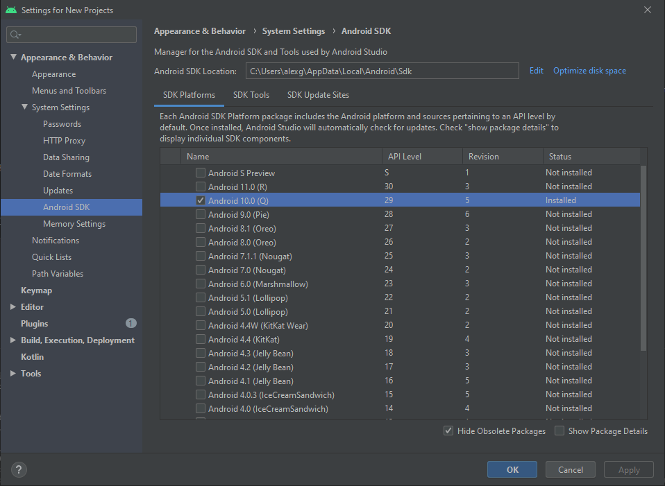
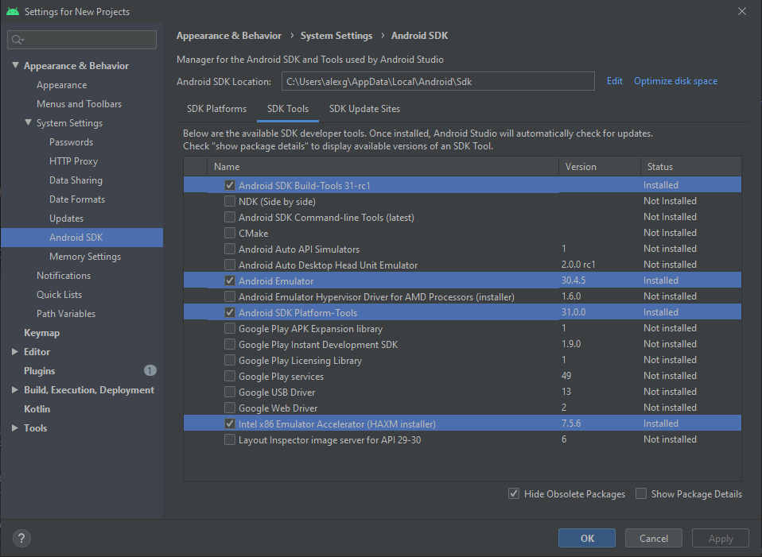
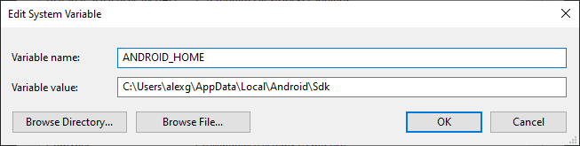

## Installing the Android development environment

Install [Android Studio](https://developer.android.com/studio#downloads). Then, from the SDK manager install the following packages (you may need to choose a emulator accelerator other than `Intel x86 Emulator Accelerator (HAXM installer)`, see [Configure hardware acceleration](https://developer.android.com/studio/run/emulator-acceleration#vm-windows)):




Then, create an environment variable named `ANDROID_HOME` with the Android SDK root path:



Finally, create an [Android Virtual Device](https://developer.android.com/studio/run/managing-avds).

## Troubleshooting

- `Android project not found` when running `npm run android`: [Delete signing-config.json](https://reactnativecode.com/android-project-not-found/) or [fix its permissions](https://stackoverflow.com/a/56429492)

```
error Android project not found. Are you sure this is a React Native project? If your Android files are located in a non-standard location (e.g. not inside 'android' folder), consider setting `project.android.sourceDir` option to point to a new location.
```
